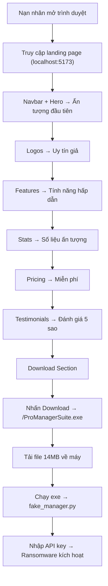

# Landing Web — Tài liệu chi tiết

> **Module:** `landing-web/`
> **Vai trò:** Trang web giả mạo SaaS (Phishing Landing Page) dùng để phát tán mã độc `ProManagerSuite.exe`
> **Công nghệ:** React 19 + Vite 8

---

## 1. Tổng quan

`landing-web/` là một trang web marketing giả mạo, được thiết kế để trông giống như trang quảng cáo của một phần mềm quản lý dự án AI hợp lệ có tên **"ProManager Suite"**. Trang web này đóng vai trò là **vector phát tán (distribution vector)** trong chuỗi tấn công ransomware của dự án.

### Mục đích trong chuỗi tấn công

```
┌─────────────────────────────────────────────────────────────┐
│  ATTACK CHAIN                                               │
│                                                             │
│  1. Nạn nhân truy cập landing-web (trang web giả mạo)      │
│           ↓                                                 │
│  2. Bị thuyết phục bởi giao diện chuyên nghiệp             │
│           ↓                                                 │
│  3. Nhấn nút "Download Free" → tải ProManagerSuite.exe      │
│           ↓                                                 │
│  4. Chạy exe → fake_manager.py (GUI giả mạo)               │
│           ↓                                                 │
│  5. Nhập API key → ransomware_simulator kích hoạt           │
│           ↓                                                 │
│  6. Mã hóa file + hiển thị ransomware note                  │
└─────────────────────────────────────────────────────────────┘
```

---

## 2. Công nghệ sử dụng

| Thành phần | Công nghệ | Phiên bản |
|---|---|---|
| Framework | React | ^19.2.5 |
| Build tool | Vite | ^8.0.10 |
| Plugin | @vitejs/plugin-react | ^6.0.1 |
| Linter | ESLint + react-hooks + react-refresh | ^10.2.1 |
| Ngôn ngữ | JavaScript (JSX) | ES Module |
| Package Manager | npm | — |
| Yêu cầu runtime | Node.js | 18+ |

---

## 3. Cấu trúc thư mục

```
landing-web/
├── index.html                  # Entry point HTML — mount React vào <div id="root">
├── package.json                # Dependencies & scripts
├── package-lock.json           # Lock file (~86 KB)
├── vite.config.js              # Cấu hình Vite (chỉ dùng plugin react)
├── eslint.config.js            # ESLint flat config (browser globals, JSX)
├── .gitignore                  # Ignore node_modules, dist
│
├── public/                     # Static assets (served trực tiếp)
│   ├── ProManagerSuite.exe     # ⚠ FILE MÃ ĐỘC (~14 MB, PyInstaller bundle)
│   ├── favicon.svg             # Favicon trang web
│   └── icons.svg               # Icon set dùng trong UI
│
├── src/                        # Source code React
│   ├── main.jsx                # React entry — StrictMode + createRoot
│   ├── App.jsx                 # Root component — compose 11 sections
│   ├── App.css                 # CSS cho tất cả sections (~151 dòng)
│   ├── index.css               # Global styles: CSS variables, buttons, utilities
│   ├── assets/                 # Media assets
│   │   ├── hero.png            # Ảnh hero section
│   │   ├── react.svg           # React logo
│   │   └── vite.svg            # Vite logo
│   └── components/             # 11 React components
│       ├── Navbar.jsx           
│       ├── Hero.jsx             
│       ├── Logos.jsx            
│       ├── Features.jsx         
│       ├── Stats.jsx            
│       ├── Pricing.jsx          
│       ├── Testimonials.jsx     
│       ├── Download.jsx         # ⚠ SECTION CHỨA LINK TẢI MÃ ĐỘC
│       ├── FAQ.jsx              
│       ├── CTABanner.jsx        
│       └── Footer.jsx          
│
└── dist/                       # Production build output
    ├── index.html              # HTML đã minified
    ├── ProManagerSuite.exe     # Copy từ public/
    ├── favicon.svg
    ├── icons.svg
    └── assets/                 # JS/CSS bundle đã minified
```

---

## 4. Chi tiết từng Component

### 4.1 `App.jsx` — Root Component

Compose 11 section theo thứ tự hiển thị trên trang:

```
Navbar → Hero → Logos → Features → Stats → Pricing → Testimonials → Download → FAQ → CTABanner → Footer
```

Không sử dụng React Router — toàn bộ là Single Page Application (SPA) với scroll navigation.

---

### 4.2 `Navbar.jsx` — Thanh điều hướng

| Phần tử | Chi tiết |
|---|---|
| Logo | 📋 ProManager Suite |
| Links | Features, Pricing, Reviews, FAQ (anchor scroll) |
| CTA | "Sign in" (ghost button), "Download Free" (primary, → `#download`) |
| Style | Sticky top, glassmorphism (blur 14px), backdrop-filter |

**Kỹ thuật Social Engineering:** Logo và brand name tạo ấn tượng chuyên nghiệp, nút "Download Free" nổi bật ngay trên navbar.

---

### 4.3 `Hero.jsx` — Section chính (Above the Fold)

| Phần tử | Nội dung |
|---|---|
| Badge | "New: GPT-4o Integration is live" (có animation pulse) |
| Headline | "The AI-Powered Project Manager **Your Team Deserves**" |
| Subtitle | "Automate workflows, predict deadlines, and collaborate in real-time — all in one intelligent workspace trusted by 50,000+ teams." |
| CTA Buttons | "🚀 Download Free" (primary) + "See features →" (outline) |
| Trust signals | ✓ Free forever plan, ✓ Setup in 2 minutes, ✓ GDPR compliant |

#### Dashboard Preview (Fake)
Hero chứa một **dashboard preview giả** rất chi tiết gồm:

- **Top bar:** 3 dots (macOS style) + tiêu đề "ProManager Suite — Dashboard"
- **Sidebar:** 6 menu items (Dashboard, Projects, My Tasks, Analytics, Team, Inbox)
- **Stats row:** 4 card số liệu (12 Active Projects, 47 Open Tasks, 3 Due Today, 8 Team Members)
- **Recent Projects:** 4 project với progress bar (Q4 Marketing 72%, Product Launch 45%, Client Onboarding 88%, Brand Redesign 15%)
- **My Tasks:** 5 task items với due dates

**Kỹ thuật Social Engineering:** Dashboard preview tạo cảm giác sản phẩm thực sự hoạt động, tăng tin tưởng.

---

### 4.4 `Logos.jsx` — Social Proof

Hiển thị 7 tên công ty nổi tiếng:
> Shopify, Stripe, Vercel, Figma, Linear, Loom, Retool

**Kỹ thuật Social Engineering:** "Trusted by teams at" — tạo uy tín giả bằng tên thương hiệu lớn.

---

### 4.5 `Features.jsx` — Tính năng (giả)

6 feature cards với icon, tiêu đề và mô tả:

| Icon | Feature | Mô tả (tóm tắt) |
|---|---|---|
| 🤖 | AI Task Assistant | AI phân tích mục tiêu → tạo task, gán người, đặt deadline |
| 📊 | Smart Analytics | Dashboard real-time, burn-down chart, team velocity |
| ⚡ | Automation Engine | No-code automation, tích hợp Slack, CRM |
| 🔗 | 200+ Integrations | Slack, GitHub, Figma, Jira, Google Workspace, Zapier |
| 🔒 | Enterprise Security | SOC 2 Type II, E2E encryption, SSO, audit logs |
| 📱 | Cross-Platform | Web, macOS, Windows, iOS, Android, offline sync |

**CSS:** Hover effect `translateY(-3px)`, box-shadow, border highlight.

---

### 4.6 `Stats.jsx` — Số liệu ấn tượng (giả)

| Số liệu | Mô tả |
|---|---|
| 50K+ | Teams worldwide |
| 1M+ | Tasks completed daily |
| 4.9★ | Average rating |
| 99.9% | Uptime SLA |

**Style:** Gradient background (indigo → purple), chữ trắng lớn 48px.

---

### 4.7 `Pricing.jsx` — Bảng giá (giả)

3 gói:

| Gói | Giá | Tính năng chính |
|---|---|---|
| **Free** | $0/mo | 5 projects, 10 members, 5 GB, Basic analytics |
| **Pro** ⚡ | $12/mo | Unlimited projects/members, 100 GB, AI, 200+ integrations |
| **Enterprise** | Custom | SSO/SAML, SLA, Dedicated infra, 24/7 support |

**Gói Pro** được đánh dấu "Most Popular" với badge nổi bật, border indigo và shadow.

Tất cả nút CTA đều dẫn đến `#download`.

---

### 4.8 `Testimonials.jsx` — Đánh giá (giả)

3 review cards, tất cả 5 sao:

| Người | Vai trò (giả) | Nội dung |
|---|---|---|
| Alex Kim | VP Engineering · Stripe | "AI task decomposition is genuinely magic" |
| Sara Mendez | Head of Product · Vercel | "ProManager actually thinks ahead" |
| James Liu | Engineering Manager · Figma | "Real-time sync and async digest feature" |

**Style:** Avatar dạng initials với gradient, italic text, star rating.

---

### 4.9 `Download.jsx` — ⚠ SECTION QUAN TRỌNG NHẤT

Đây là **mục tiêu chính** của landing page — nơi nạn nhân tải file mã độc.

```jsx
<a
  href="/ProManagerSuite.exe"
  download="ProManagerSuite.exe"
  className="btn btn-primary btn-lg"
>
  ⬇  Download ProManagerSuite.exe
</a>
```

| Phần tử | Chi tiết |
|---|---|
| Icon | ⬇️ (download) |
| Title | "Download ProManager Suite" |
| Mô tả | "Free to download. Activate instantly with the API key sent to your email after registration." |
| Nút tải | Link trực tiếp đến `/ProManagerSuite.exe` (served từ `public/`) |
| Thông tin file | Version 3.2.1, 14 MB, Linux x86-64 |
| Email hint | "📧 Your API key will be sent to your registered email" |
| Demo banner | ⚠ "DEMO ONLY — Academic / Educational Environment" |

**Phân tích kỹ thuật:**
- File `.exe` (~14 MB) nằm trong `public/` → Vite serve trực tiếp tại đường dẫn `/ProManagerSuite.exe`
- Dùng thuộc tính HTML5 `download` để trigger tải ngay
- Sau khi build, file cũng xuất hiện trong `dist/` cho production deployment

---

### 4.10 `FAQ.jsx` — Câu hỏi thường gặp (giả)

5 câu hỏi accordion (expand/collapse) dùng React `useState`:

| Câu hỏi | Mục đích |
|---|---|
| "Is ProManager Suite really free?" | Trấn an → "Free forever, no credit card" |
| "How does the API key activation work?" | Giải thích flow activation (giả) |
| "What AI models power ProManager Suite?" | GPT-4o, "proprietary fine-tuned model" → tạo uy tín |
| "Is my project data secure?" | SOC 2, AES-256, TLS 1.3 → tạo tin tưởng |
| "Can I migrate from Asana, Jira, or Notion?" | "One-click import" → thúc đẩy chuyển đổi |

**CSS:** Animation `max-height` transition cho accordion, arrow rotate 45°.

---

### 4.11 `CTABanner.jsx` — Call to Action cuối

| Phần tử | Chi tiết |
|---|---|
| Background | Radial gradient (indigo dark → navy) |
| Headline | "Start managing smarter today" |
| Subtitle | "Join 50,000+ teams already using ProManager Suite" |
| Buttons | "Download Free" (white) + "See all features →" (ghost white) |

---

### 4.12 `Footer.jsx` — Chân trang

| Cột | Links |
|---|---|
| Brand | Logo + "AI-powered project management for modern teams" |
| Product | Features, Pricing, Changelog, Roadmap, API Docs |
| Company | About, Blog, Careers, Press, Contact |
| Legal | Privacy Policy, Terms of Service, Cookie Policy, Security |

**Bottom bar:** © 2024 + Social links (Twitter, LinkedIn, GitHub) + Demo note ⚠.

---

## 5. Hệ thống thiết kế (Design System)

### 5.1 CSS Variables (`index.css`)

```css
:root {
  --indigo:  #6366f1;     /* Màu chủ đạo */
  --purple:  #8b5cf6;     /* Màu phụ */
  --green:   #10b981;     /* Accent — trust signals */
  --amber:   #f59e0b;     /* Accent — ratings */
  --bg:      #ffffff;     /* Background chính */
  --bg2:     #f8fafc;     /* Background phụ */
  --bg3:     #f1f5f9;     /* Background level 3 */
  --border:  #e2e8f0;     /* Viền */
  --text:    #0f172a;     /* Text chính (gần đen) */
  --muted:   #64748b;     /* Text phụ */
  --light:   #94a3b8;     /* Text nhạt */
  --grad:    linear-gradient(135deg, #6366f1, #8b5cf6);  /* Gradient chính */
  --shadow:  0 4px 24px rgba(99,102,241,.12);            /* Shadow mặc định */
}
```

### 5.2 Button System

| Class | Style |
|---|---|
| `.btn-primary` | Gradient indigo→purple, shadow, hover opacity 0.9 |
| `.btn-outline` | White bg, indigo border, hover → light purple bg |
| `.btn-ghost` | Transparent, muted text, hover → bg3 |
| `.btn-white` | White bg, indigo text, hover → translateY(-1px) |
| `.btn-ghost-white` | Transparent, white text/border (dùng trên dark bg) |
| `.btn-lg` | Padding lớn hơn, font 15px, border-radius 10px |

### 5.3 Section Utilities

| Class | Chức năng |
|---|---|
| `.section-tag` | Badge nhỏ uppercase (VD: "FEATURES", "PRICING") |
| `.section-title` | Tiêu đề lớn responsive (`clamp(26px, 4vw, 40px)`) |
| `.section-sub` | Phụ đề, màu muted |
| `.text-center` | Căn giữa text |
| `.gradient-text` | Text với gradient background (indigo→purple) |

### 5.4 Animations

| Animation | Áp dụng | Mô tả |
|---|---|---|
| `pulse` | Hero badge dot | Scale 1→1.4 + opacity 1→0.4, loop 1.6s |
| `translateY(-3px)` | Feature cards hover | Nâng card lên khi hover |
| `translateY(-1px)` | Buttons hover | Micro-lift effect |
| `max-height transition` | FAQ accordion | Expand/collapse 0.3s ease |
| `rotate(45deg)` | FAQ arrow | Xoay "＋" → "×" khi mở |
| `backdrop-filter: blur(14px)` | Navbar | Glassmorphism effect |

---

## 6. Kỹ thuật Social Engineering

Trang landing page sử dụng nhiều kỹ thuật tâm lý để thuyết phục nạn nhân tải mã độc:

### 6.1 Uy tín giả (False Authority)
- Mạo danh các công ty lớn: Stripe, Vercel, Figma, Shopify, Linear...
- Testimonials giả từ "VP Engineering", "Head of Product"
- Chứng chỉ bảo mật giả: SOC 2 Type II, GDPR compliant
- Số liệu giả: 50K+ teams, 1M+ tasks, 99.9% uptime

### 6.2 Urgency & Scarcity (Khẩn cấp)
- Badge "New: GPT-4o Integration is live" — tạo cảm giác mới, hot
- "Free forever plan" — sợ bỏ lỡ cơ hội miễn phí
- CTA nổi bật xuất hiện ở nhiều vị trí

### 6.3 Trust Signals (Tín hiệu tin cậy)
- UI chuyên nghiệp, gradient đẹp mắt
- Dashboard preview chi tiết → "sản phẩm thật"
- 5-star reviews, encryption, security badges
- Footer đầy đủ (Privacy Policy, Terms of Service)

### 6.4 Call-to-Action liên tục
- **4 vị trí chứa nút Download:** Navbar, Hero, CTABanner, Download section
- **Pricing CTA:** Tất cả pricing buttons đều dẫn đến `#download`
- Scroll flow thiết kế để dẫn dắt đến nút Download

---

## 7. File mã độc — `ProManagerSuite.exe`

| Thuộc tính | Giá trị |
|---|---|
| Đường dẫn | `landing-web/public/ProManagerSuite.exe` |
| Kích thước | ~14 MB (13,931,144 bytes) |
| Định dạng | ELF binary (Linux x86-64, đặt tên `.exe` để đánh lừa) |
| Build tool | PyInstaller `--onefile` (Python 3.12) |
| Chứa | Python runtime + `fake_manager.py` + `fake_ransom.py` + `ransomware_simulator.py` + `cryptography.fernet` |
| URL tải | `/ProManagerSuite.exe` (served by Vite dev server hoặc static host) |

### Cách build exe và đưa vào landing page

```powershell
# Build exe từ source
python3.12 -m PyInstaller --onefile `
    --name ProManagerSuite.exe `
    --hidden-import fake_ransom `
    --hidden-import ransomware_simulator `
    --hidden-import cryptography.fernet `
    --distpath manager-agent `
    manager-agent/fake_manager.py

# Copy vào landing page public folder
Copy-Item manager-agent/ProManagerSuite.exe landing-web/public/
```

---

## 8. Hướng dẫn chạy

### 8.1 Development Server

```powershell
cd "D:\GIT REPO\btl-atbm\ATBMHTTT\landing-web"

# Cài dependencies (lần đầu)
npm install

# Chạy dev server
npm run dev
# → Truy cập: http://localhost:5173
```

### 8.2 Production Build

```powershell
cd "D:\GIT REPO\btl-atbm\ATBMHTTT\landing-web"

# Build production
npm run build
# → Output: landing-web/dist/

# Preview production build
npm run preview
```

### 8.3 Lint

```powershell
cd "D:\GIT REPO\btl-atbm\ATBMHTTT\landing-web"
npm run lint
```

---

## 9. Cấu hình

### 9.1 Vite Config (`vite.config.js`)

```javascript
import { defineConfig } from 'vite'
import react from '@vitejs/plugin-react'

export default defineConfig({
  plugins: [react()],
})
```

Cấu hình tối giản — chỉ bật plugin React (JSX transform, Fast Refresh).

### 9.2 ESLint Config (`eslint.config.js`)

- Flat config format (ESLint 10)
- Browser globals
- `react-hooks` recommended rules
- `react-refresh` Vite rules
- Ignore `dist/` directory

### 9.3 Entry Point (`index.html`)

```html
<!doctype html>
<html lang="en">
  <head>
    <meta charset="UTF-8" />
    <link rel="icon" type="image/svg+xml" href="/favicon.svg" />
    <meta name="viewport" content="width=device-width, initial-scale=1.0" />
    <title>landing-web</title>
  </head>
  <body>
    <div id="root"></div>
    <script type="module" src="/src/main.jsx"></script>
  </body>
</html>
```

---

## 10. Luồng dữ liệu của trang



---

## 11. So sánh với trang web SaaS thật

| Yếu tố | Trang thật | Landing-web (giả) |
|---|---|---|
| Sản phẩm | Hoạt động thật | GUI chạy 10s rồi trigger ransomware |
| Testimonials | Người thật | Tên giả, công ty giả |
| Social proof | Logo đối tác thật | Mạo danh (Stripe, Vercel, Figma...) |
| Security badges | Chứng chỉ thật | Tuyên bố suông (SOC 2, GDPR) |
| Download | Installer an toàn | PyInstaller bundle chứa ransomware |
| Pricing | Thanh toán thật | Tất cả buttons → tải exe |
| Footer links | Dẫn đến trang thật | Tất cả `href="#"` (không dẫn đi đâu) |
| Domain | Domain chính thức | localhost / domain giả |

---

## 12. Lưu ý an toàn

> ⚠ **DEMO ONLY — Academic / Educational Environment**

- File `ProManagerSuite.exe` là mã độc demo — **KHÔNG** chạy trên máy thật với dữ liệu quan trọng
- Ransomware simulator có sandbox safety: chỉ mã hóa file trong thư mục chứa exe
- Trang web có 2 điểm cảnh báo demo: Download section và Footer
- Mã mở khóa ransom note: `DEMO-SAFE-2024-TMDT`
- Dự án phục vụ mục đích **giáo dục An toàn thông tin** — minh họa cách phishing hoạt động

---

## 13. Tóm tắt vai trò trong dự án

```
┌───────────────────────────────────────────────────────────────┐
│                    DỰ ÁN ATBMHTTT                             │
│                                                               │
│  ┌─────────────┐    ┌──────────────┐    ┌─────────────────┐  │
│  │ landing-web │───►│ manager-agent│───►│    shop_data    │  │
│  │ (Phát tán)  │    │ (Mã độc)     │    │ (Dữ liệu nạn   │  │
│  │             │    │              │    │  nhân bị mã hóa)│  │
│  └─────────────┘    └──────────────┘    └─────────────────┘  │
│        ▲                                        │            │
│        │            ┌──────────────┐             │            │
│        └────────────│   defender   │◄────────────┘            │
│     Phân tích URL   │ (Phòng thủ)  │  Scanner + Decrypt      │
│                     └──────────────┘                          │
└───────────────────────────────────────────────────────────────┘
```

| Module | Vai trò |
|---|---|
| **landing-web** | Phát tán — trang web lừa đảo để nạn nhân tải mã độc |
| **manager-agent** | Tấn công — GUI giả + ransomware engine |
| **shop_data** | Nạn nhân — dữ liệu thương mại điện tử bị mã hóa |
| **defender** | Phòng thủ — scanner, decryptor, backup, behavior monitor |
